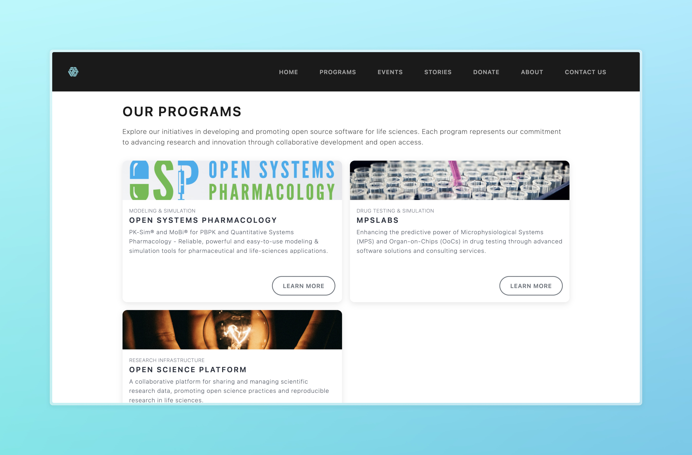

# CLS Foundation Website Content Management Guide


## Overview

This website is built using [Quarto](https://quarto.org/), a markdown-based publishing system. Content is written in plain text files with simple formatting (markdown) that get converted to a fully-functioning website. The site automatically displays listings of programs, events, stories, and team members.


## Repository Structure

Below is the simplified directory structure showing only what's relevant for content editors:

```
cls-website/
├── _quarto.yml        # Main configuration file
├── index.qmd          # Homepage content
├── about.qmd          # About page content
├── programs.qmd       # Programs listing page
├── events.qmd         # Events listing page 
├── stories.qmd        # Stories listing page
├── donate.qmd         # Donation page
├── contact_us.qmd     # Contact page
├── programs/          # Individual program files
│   ├── program1.qmd   # Each program has its own file
│   └── program2.qmd
├── events/            # Individual event files
│   ├── event1.qmd     # Each event has its own file
│   └── event2.qmd  
├── stories/           # Individual story files
│   ├── story1.qmd     # Each success story has its own file
│   └── story2.qmd
├── members/           # Team member files
│   ├── member1.qmd    # Each team member has their own file
│   └── member2.qmd
└── assets/            # Images and other media files
```

As a content editor, you'll primarily work with files in the `programs/`, `events/`, `stories/`, and `members/` directories.

## How Content Files Become Web Pages

Each content file (`.qmd`) you create (with the proper metadata) automatically appears in the appropriate listing page and also gets a dedicated page (accessible by clicking on the rounded button). No additional steps are needed to update the website navigation or listings - the system handles this automatically.


## Default Placeholders

If no image is provided in the frontmatter metadata, the website will automatically use default placeholder images:

| Programs | Events | Stories | News |
|:--------:|:------:|:-------:|:----:|
| {height=150} | {height=150} | {height=150} | {height=150} |

These placeholders ensure a consistent look even when custom images are not available. You can always replace them later by adding an `image` field to your content's frontmatter.

## Setup Your Work Environment

1. **Install Required Software:**
   - Install [R](https://cran.r-project.org/)
   - Install [Quarto](https://quarto.org/docs/get-started/)
   - Install [RStudio](https://posit.co/download/rstudio-desktop/)

   

2. **Get the Website Code:**
   - Clone this repository or download it to your computer
   - Open the project in RStudio by clicking on `cls-website.Rproj`

3. **Install R Dependencies:**
   - Open R console and run: `renv::restore()` 
   - This installs all required R packages based on the renv.lock file


## Understanding Markdown

The website content is written in Markdown - a simple markup language that's easy to learn:

- Basic formatting: **bold**, *italic*, [links](https://example.com)
- Lists (like this one)
- Headings (using # symbols)

Learn more: [Markdown Basics](https://quarto.org/docs/authoring/markdown-basics.html)


## Adding Content to the Website

The website automatically generates cards and pages for programs, events, stories, and team members using Quarto's "listing" feature. When you add a new file in the appropriate folder with the correct metadata, the website will:

1. Create a card for that item in the relevant listing page (e.g., programs.qmd)
2. Generate a dedicated page for the item with all its content
3. Include the item in listings on the homepage (if applicable)

No coding is required - just add your content files with the right metadata, and the website handles the rest.

This example shows how story files in the `stories/` directory automatically appear on the website:

```{.smaller-code style="font-size: 0.7em;"}
stories/
├── story_1.qmd
│   ├── title: "How CompanyX Increased Efficiency"
│   ├── description: "CompanyX streamlined operations..."
│   ├── client: "CompanyX"
│   ├── thumbnail: "https://picsum.photos/300/200?random=1"
│   ├── date: "2024-03-20"
│   ├── categories: ["Digital Transformation"]
│   └── industry: "Manufacturing"
│
├── story_2.qmd
│   ├── title: "Research Lab Collaboration"
│   ├── description: "How we helped researchers..."
│   ├── client: "University Research Lab"
│   ├── thumbnail: "https://picsum.photos/300/200?random=2"
    ├── date: "2024-02-15"
    ├── categories: ["Research", "Collaboration"]
    └── industry: "Academic"
...
```

Will be rendered like this in the `/stories` page:


And Each `story_*.qmd` file will have their own page (accessible through the `Read More` button):


### Programs

Create a new file in the `programs/` folder named `your-program-name.qmd` with this metadata at the top:

```
---
title: "Program Title"
description: "Brief description of the program"
image: "URL to program image"
category: "Program Category"
priority: 4  # Lower numbers appear first
url: "URL to more information" # or leave as "/programs/your-program-name"
---
```

Then add your content below using markdown.



### Events

Create a new file in the `events/` folder named `your-event-name.qmd` with this metadata:

```
---
title: "Event Title"
description: "Brief event description"
date: "YYYY-MM-DD"
end_date: "YYYY-MM-DD"  # Optional
image: "URL to event image"
location: "Event Location"
url: "URL for more info"  # Optional
categories: ["Category1", "Category2"]
---
```


### Stories

Create a new file in the `stories/` folder named `story-name.qmd` with this metadata:

```yaml
---
draft: false  # Set to true if the story is not ready to be published
title: "Story Title"
description: "Brief description"
date: "YYYY-MM-DD"
client: "Client Name"
image: "URL to image"  # Optional
categories: ["Category1", "Category2"]
industry: "Industry Type"
---
```


### Team Members

Create a new file in the `members/` folder named `person-name.qmd` with this metadata:

```yaml
---
title: "Person Name"
draft: false  # Set to true if the member should not be displayed yet
position: "Job Title"
email: "email@example.com"
image: "URL to profile image"  # Optional
order: 3  # Lower numbers appear first
description: "Brief bio that appears in the member card"
---
```


## Previewing and Publishing

### Render Website Locally

To preview changes before publishing:

1. Open terminal/command prompt in project folder
2. Run: `quarto preview` 
3. A browser will open showing the site
4. Changes to files will automatically refresh the preview


### Publish Changes

When you're satisfied with your changes:

1. Commit and push changes to the main branch
2. The website will automatically build and deploy

## Common Operations

- **Update existing content**: Edit the corresponding `.qmd` file
- **Remove content**: Delete the corresponding `.qmd` file
- **Change order**: Adjust the `priority` or `order` values in metadata
- **Update styling**: Contact the web developer for changes to visual design

## Need Help?

Refer to the [Quarto documentation](https://quarto.org/docs/guide/) for more details on markdown formatting and website features.